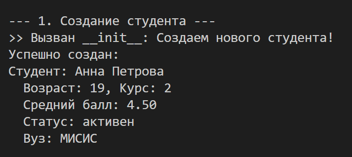
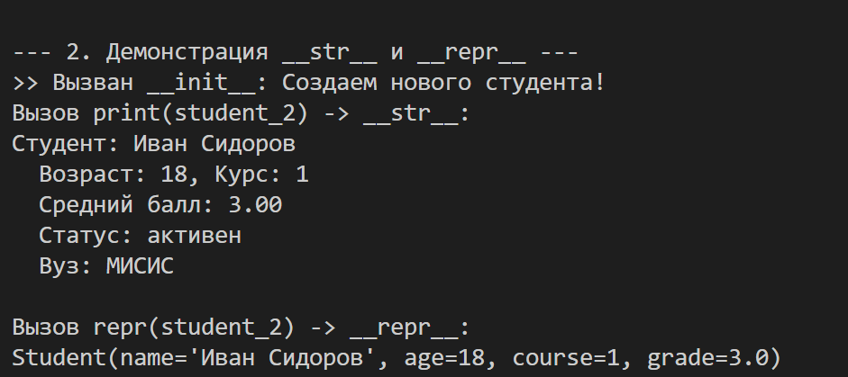
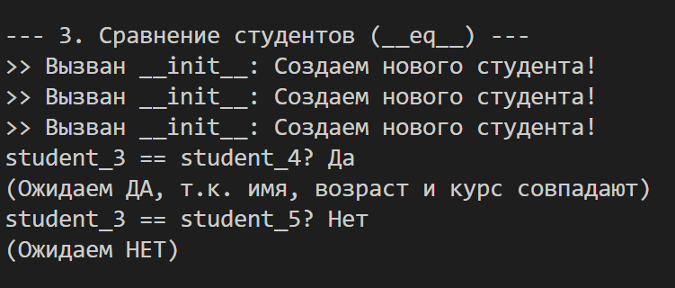
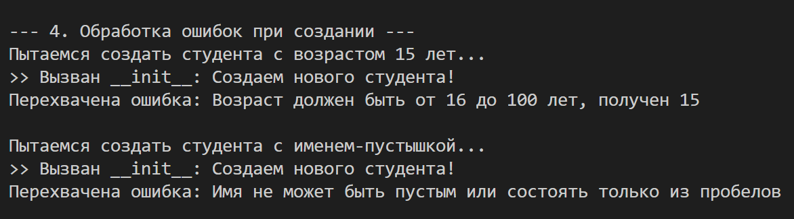
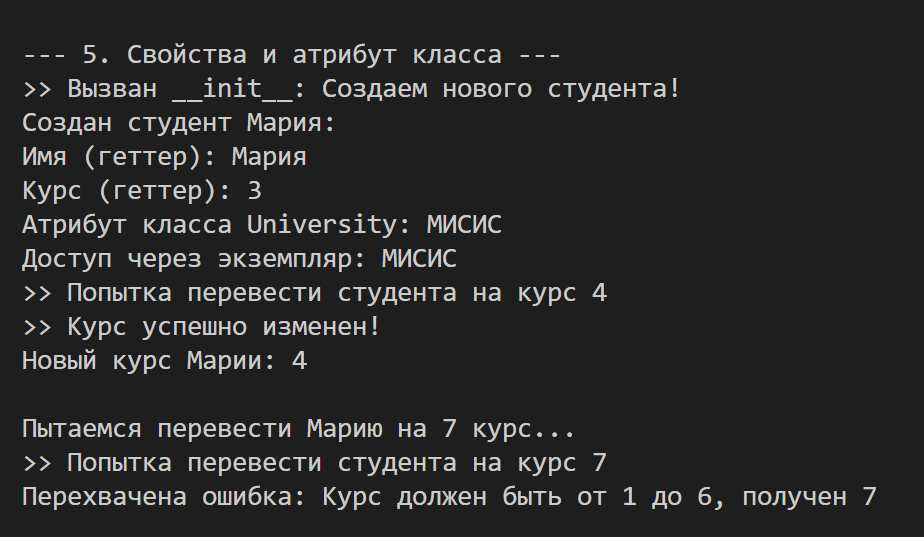
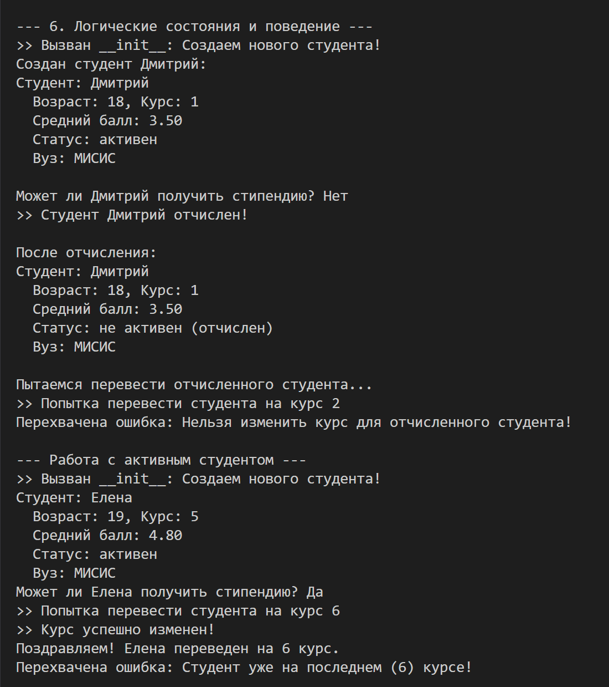

# Отчет по лабораторной работе №1
## Тема: Класс и инкапсуляция
## Вариант 1: Образование (Класс Student)

## Цель работы

* Освоить объявление пользовательских классов в Python
* Разобраться с инкапсуляцией (атрибуты экземпляра, закрытые поля)
* Реализовать свойства (`@property`) для контролируемого доступа к данным
* Переопределить магические методы (`__str__`, `__repr__`, `__eq__`)
* Осознать разницу между атрибутами класса и экземпляра
* Научиться обрабатывать ошибки и валидировать данные

### Атрибуты класса и экземпляра

| Атрибут | Тип | Описание | Доступ |
|---------|-----|----------|--------|
| `university_name` | str | Название университета (атрибут класса) | Через класс и экземпляр |
| `_name` | str | Имя студента (закрытый) | Через геттер `name` |
| `_age` | int | Возраст студента (закрытый) | Через геттер `age` |
| `_course` | int | Курс обучения (закрытый) | Через свойства `course` |
| `_grade` | float | Средний балл (закрытый) | Через свойства `grade` |
| `_is_active` | bool | Статус (активен/отчислен) | Через геттер `is_active` |

### Ограничения (валидация)

| Поле | Проверка типа | Логическая проверка |
|------|---------------|---------------------|
| Имя (`name`) | `str` | Не пустая строка, не только пробелы |
| Возраст (`age`) | `int` | От 16 до 100 лет |
| Курс (`course`) | `int` | От 1 до 6 |
| Оценка (`grade`) | `int` или `float` | От 2.0 до 5.0 |

### Методы класса

| Метод | Описание |
|-------|----------|
| `__init__` | Конструктор, создает студента с проверкой данных |
| `__str__` | Строковое представление для пользователя (красивый вывод) |
| `__repr__` | Строковое представление для разработчика (детальное) |
| `__eq__` | Сравнение студентов по имени, возрасту и курсу |
| `expel()` | Отчисление студента (меняет состояние) |
| `upgrade_course()` | Перевод на следующий курс (зависит от состояния) |
| `grant_scholarship()` | Проверка на получение стипендии (зависит от состояния) |

## Сценарий 1. Создание студента:

## Сценарий 2. Демонстрация _str_ и _repr_:

## Сценарий 3. Сравнение студентов:

## Сценарий 4. Ошибки:

## Сценарий 5. Свойства и атрибут класса:

## Сценарий 6. Логические состояния и поведение:

### Ответы на вопросы:
# Ответы на контрольные вопросы по лабораторной работе №1

## Вопрос 1. Что является сущностью?

**Сущность** — это **студент** (класс `Student`).

Студент — центральная фигура в образовательном процессе. В реальном мире это конкретный человек, который учится в университете, имеет персональные данные и может менять свой статус.

В программе каждый студент представляется отдельным объектом (экземпляром класса) с уникальными характеристиками:

## Вопрос 2. Какие у него атрибуты?
У сущности "студент" есть 5 атрибутов (характеристик). Все они закрытые (с нижним подчеркиванием), доступ к ним осуществляется через свойства:
| Атрибут | Тип | Описание | Доступ |
|---------|-----|----------|--------|
| `_name` | `str` | Имя студента | Только чтение |
| `_age` | `int` | Возраст (16-100) | Только чтение |
| `_course` | `int` | Курс (1-6) | Чтение и запись |
| `_grade` | `float` | Средний балл (2.0-5.0) | Чтение и запись |
| `_is_active` | `bool` | Статус (активен/отчислен) | Только чтение |
| `university_name` | `str` | Название вуза | Общий для всех |

## Вопрос 3. Какие инварианты?
Инварианты — правила, которые всегда должны выполняться:

| Инвариант | Правило |
|-----------|---------|
| **Имя** | Не пустое и не из пробелов |
| **Возраст** | От 16 до 100 лет |
| **Курс** | От 1 до 6 |
| **Оценка** | От 2.0 до 5.0 |
| **Статус** | Только True или False |
| **Отчисленный** | Нельзя менять курс и оценку |

## Вопрос 4. Что значит “равенство”?
Два студента равны, если у них совпадают:
| Критерий | Влияет на равенство |
|----------|---------------------|
| **Имя** |  Да |
| **Возраст** |  Да |
| **Курс** |  Да |
| **Оценка** |  Нет |
| **Статус** |  Нет |

## Вопрос 5. Есть ли состояние?
Да. Студент имеет состояние — _is_active: