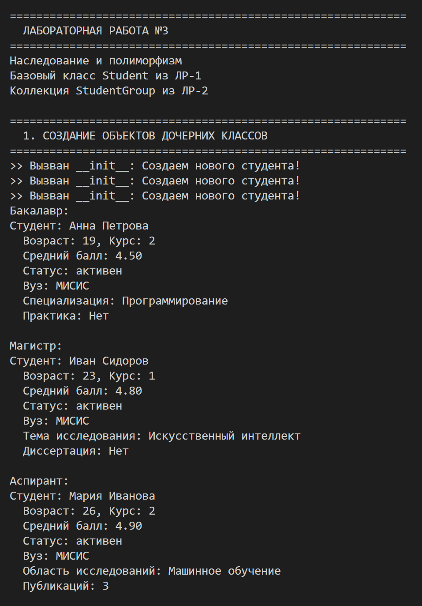

# ЛР-3 — Наследование и иерархия классов (Python 3.x)


## Цель работы

Освоить механизм наследования классов, научиться строить иерархию объектов, понять разницу между базовым и производным классом, освоить переопределение методов и полиморфизм.

---

## Реализованная иерархия

```text
Student (из ЛР-1, импортируется через base.py)
 ├── BachelorStudent  — бакалавр
 ├── MasterStudent    — магистр
 └── PhDStudent       — аспирант
```

Базовый класс Student — содержит общие атрибуты: имя, возраст, курс, средний балл, статус активности. Определяет общий интерфейс через методы grant_scholarship() (проверка стипендии) и upgrade_course() (перевод на следующий курс).

BachelorStudent — добавляет специализацию (specialization) и флаг прохождения практики (has_practice). Переопределяет upgrade_course() — бакалавр учится только до 4 курса.

MasterStudent — добавляет тему исследования (research_topic) и флаг защиты диссертации (has_thesis). Переопределяет grant_scholarship() — магистры получают стипендию только при оценке выше 4.2 (более строгое требование).

PhDStudent — добавляет область исследований (research_area) и количество публикаций (publications). Переопределяет grant_scholarship() — аспиранты получают стипендию всегда (если активны).

Каждый дочерний класс переопределяет __str__() — выводит базовую информацию плюс свои уникальные поля.

## Демонстрация работы

Сценарий 1 — создание объектов разных типов (бакалавр, магистр, аспирант) и вывод их через print().


Сценарий 2 — вызов уникальных методов каждого типа: complete_practice(), defend_thesis(), publish_article().


Сценарий 3 — полиморфизм без условий: один вызов grant_scholarship() для всех объектов, каждый отвечает по своему (бакалавр — оценка > 4.0, магистр — оценка > 4.2, аспирант — всегда True).


Сценарий 4 — переопределение upgrade_course(): бакалавр на 4 курсе не может перевестись дальше.


Сценарий 5 — интеграция с коллекцией StudentGroup из ЛР-2: коллекция хранит объекты разных типов.


Сценарий 6 — фильтрация коллекции по типу через isinstance(): вывод отдельно бакалавров, магистров и аспирантов.


Сценарий 7 — полиморфизм в коллекции: вызов grant_scholarship() для всех студентов, каждый тип ведёт себя по-своему.


Сценарий 8 — проверка типов через isinstance(): демонстрация, что дочерние объекты являются экземплярами базового класса.


Сценарий 9 — сравнение поведения grant_scholarship() при одинаковой оценке 4.5 для разных типов.


## Вывод
В ходе лабораторной работы было изучено наследование классов в Python — как дочерний класс расширяет базовый через super() не дублируя код. Освоен полиморфизм — один метод grant_scholarship() работает по-разному в зависимости от типа объекта. Реализована интеграция с коллекцией из ЛР-2 — коллекция StudentGroup хранит объекты разных типов (бакалавров, магистров, аспирантов) и корректно работает с ними. Выполнена фильтрация по типу через isinstance(). Создан файл base.py для централизованного импорта базового класса из ЛР-1.

