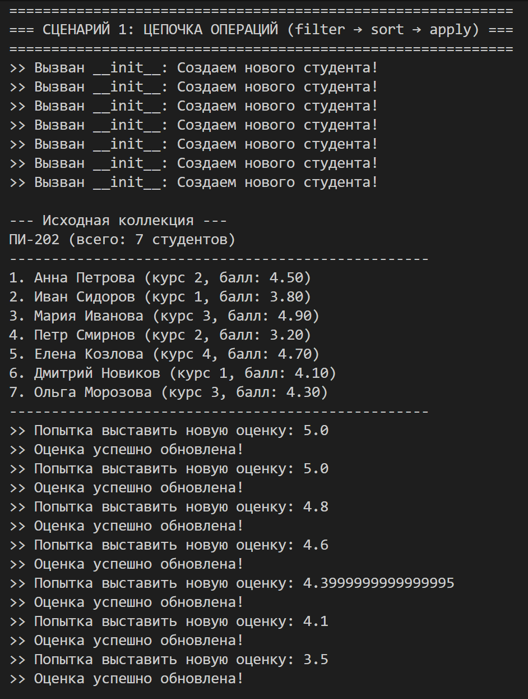
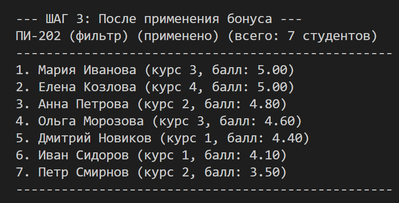
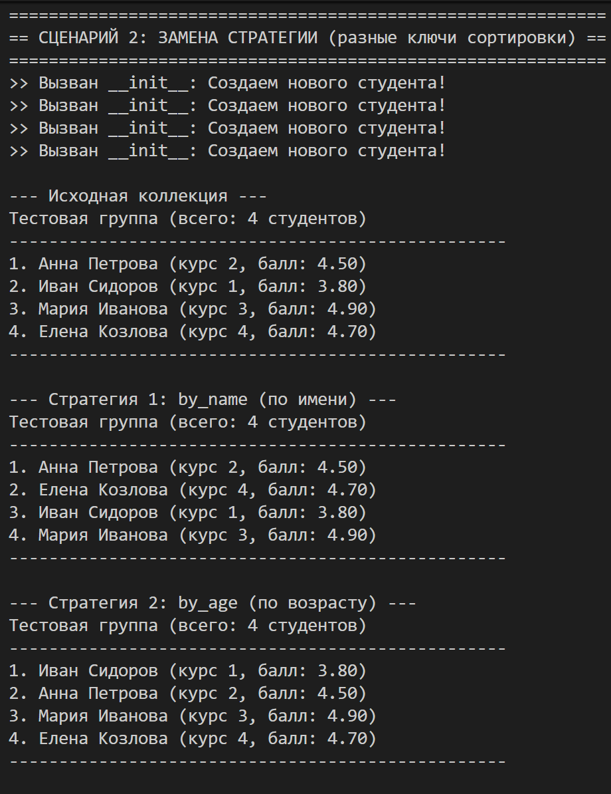
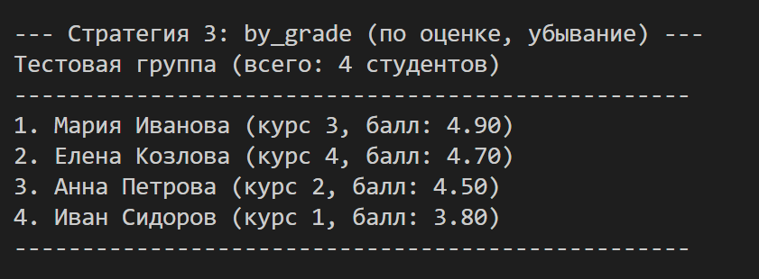
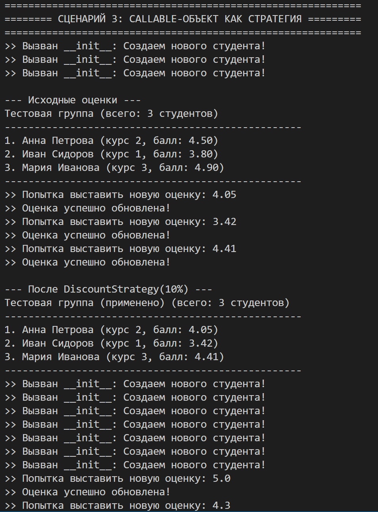
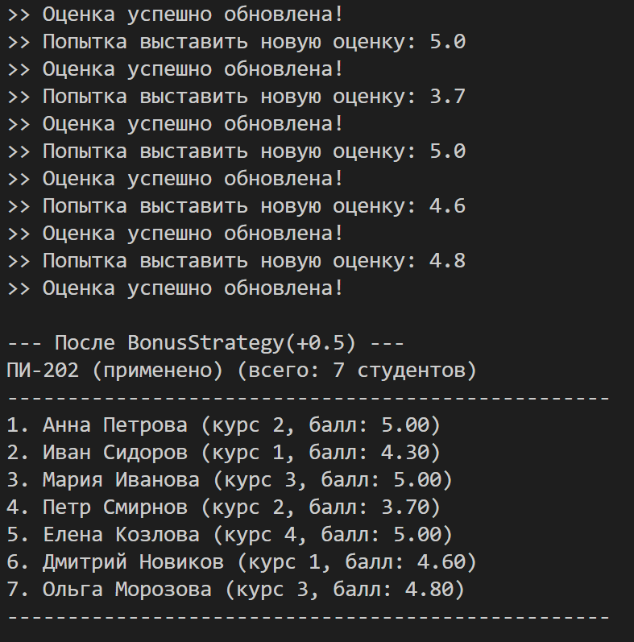
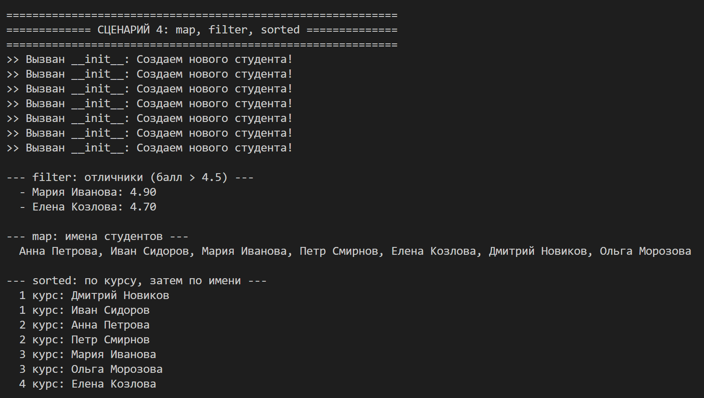
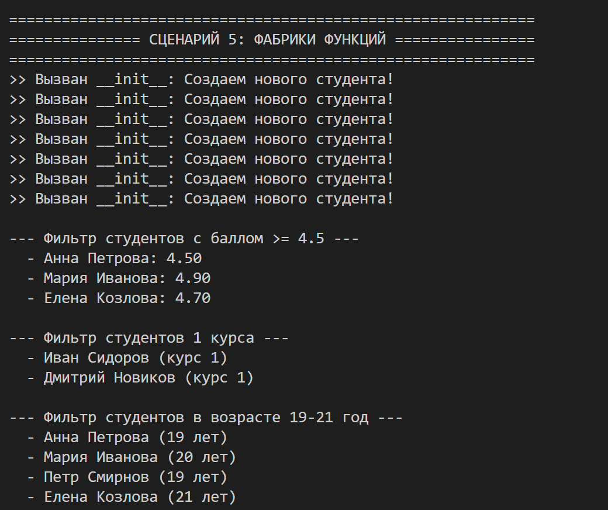

# Лабораторная работа №5 - Функции как аргументы. Стратегии и делегаты.

## 1. Цель работы

Освоить передачу функций как аргументов, научиться применять встроенные функции высшего порядка (`map`, `filter`, `sorted`), понять концепцию паттерна «Стратегия» и реализовать его на Python, освоить `lambda`-выражения.

---

## 2. Реализованные функции и стратегии

### Функции для сортировки (стратегии) - 5 шт.

| Функция | Описание |
|---------|----------|
| `by_name` | Сортировка по имени студента (по алфавиту) |
| `by_age` | Сортировка по возрасту (от младшего к старшему) |
| `by_grade` | Сортировка по среднему баллу (от худшего к лучшему) |
| `by_course` | Сортировка по курсу (от 1 к 6) |
| `by_name_then_grade` | Сортировка сначала по имени, затем по оценке |

### Функции для фильтрации - 3 шт.

| Функция | Описание |
|---------|----------|
| `is_active_filter` | Только активные студенты (не отчисленные) |
| `is_high_achiever` | Только отличники (средний балл > 4.5) |
| `is_first_course` | Только первокурсники |

### Фабрики функций

| Фабрика | Описание |
|---------|----------|
| `make_grade_filter(min_grade)` | Создаёт фильтр для студентов с оценкой выше заданного порога |
| `make_course_filter(course)` | Создаёт фильтр для студентов заданного курса |
| `make_age_filter(min_age, max_age)` | Создаёт фильтр для студентов в возрастном диапазоне |

### Callable-объект (паттерн Стратегия)

| Класс | Описание |
|-------|----------|
| `BonusStrategy` | Стратегия добавления бонуса к оценке (принимает `bonus` в конструкторе) |
| `DiscountStrategy` | Стратегия снижения оценки на заданный процент |

### Методы коллекции (расширение из ЛР-2)

| Метод | Описание |
|-------|----------|
| `sort_by(key_func, reverse)` | Сортировка по переданной функции-ключу |
| `filter_by(predicate)` | Фильтрация по переданной функции (возвращает новую коллекцию) |
| `apply(func)` | Применение функции ко всем элементам (возвращает новую коллекцию) |
| `chain(filter, sort, apply, reverse)` | Цепочка операций: фильтрация → сортировка → применение |

---

## 3. Демонстрация работы

### Сценарий 1: Цепочка операций (filter → sort → apply)

**Что демонстрирует:** Последовательное применение фильтрации, сортировки и преобразования к коллекции.

**Как работает:** Коллекция фильтруется (только активные студенты), затем сортируется по оценке (убывание), затем применяется бонус (+0.3 балла).

---

### Сценарий 2: Замена стратегии (разные ключи сортировки)

**Что демонстрирует:** Сортировку одной коллекции тремя разными стратегиями без изменения кода коллекции.

**Как работает:** Коллекция сортируется по имени, затем по возрасту, затем по оценке (убывание). Каждый раз результат разный.

---

### Сценарий 3: Callable-объект как стратегия

**Что демонстрирует:** Применение callable-объектов `BonusStrategy` и `DiscountStrategy` для обработки коллекции.

**Как работает:** Создаются стратегии с параметрами (бонус +0.5 или снижение на 10%), затем применяются ко всем студентам через метод `apply()`.

---

### Сценарий 4: map, filter, sorted

**Что демонстрирует:** Использование встроенных функций высшего порядка.

**Как работает:** `filter()` отбирает отличников, `map()` извлекает имена студентов, `sorted()` c lambda сортирует по курсу и имени.

---

### Сценарий 5: Фабрики функций

**Что демонстрирует:** Создание фильтров через фабрики с параметрами.

**Как работает:** `make_grade_filter(4.5)` создаёт фильтр для студентов с баллом ≥ 4.5, `make_course_filter(1)` — для первокурсников, `make_age_filter(19,21)` — для возрастного диапазона.

---

### Сценарий 6: Lambda-выражения

**Что демонстрирует:** Использование `lambda` для сортировки, фильтрации и преобразования.

**Как работает:** Сортировка через `lambda s: s.name`, фильтрация через `lambda s: s.grade > 4.5`, преобразование через `map` с lambda.
---

## 4. Вывод

В ходе лабораторной работы было изучено:

| Концепция | Реализация |
|-----------|------------|
| **Передача функций как аргументов** | `sort_by(key_func)`, `filter_by(predicate)`, `apply(func)` |
| **lambda-выражения** | `lambda s: s.grade`, `lambda s: s.grade > 4.5` |
| **Функции высшего порядка** | `map()`, `filter()`, `sorted()` |
| **Фабрики функций** | `make_grade_filter(4.5)`, `make_course_filter(1)` |
| **Паттерн «Стратегия»** | Взаимозаменяемые функции и callable-объекты |
| **Цепочки операций** | `filter_by() → sort_by() → apply()` |
| **Callable-объекты** | `BonusStrategy`, `DiscountStrategy` с методом `__call__` |

