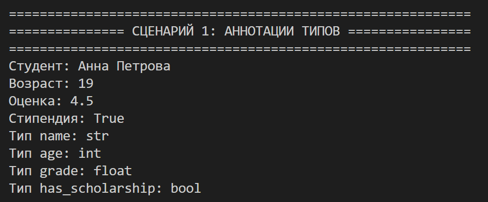
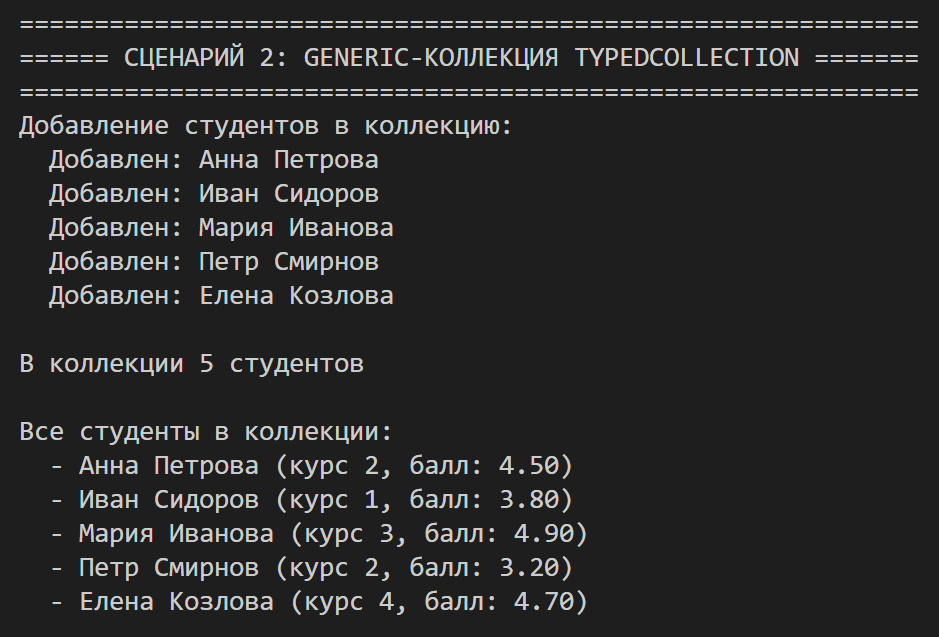
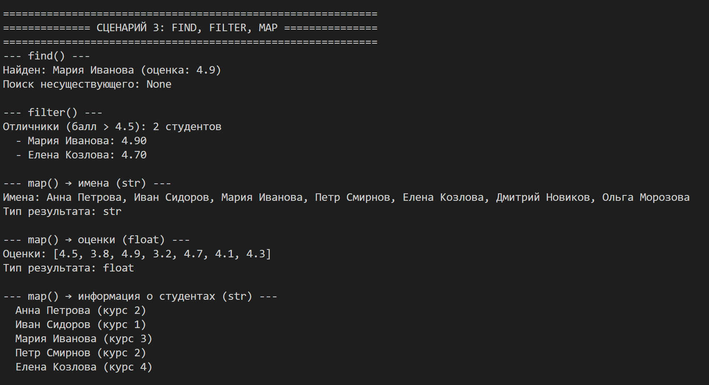
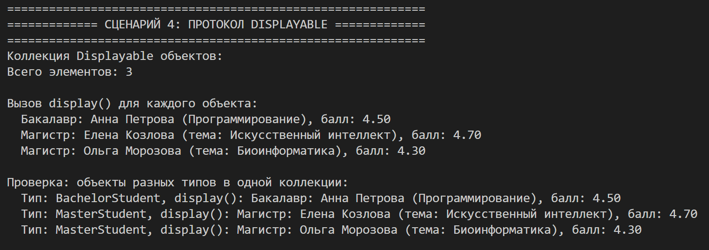
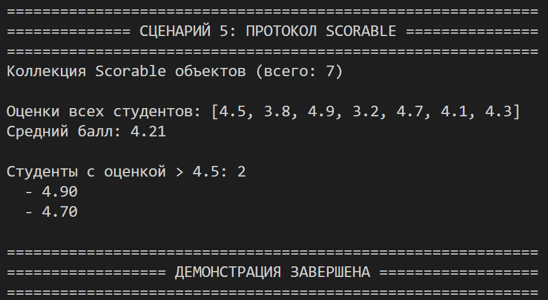

# Лабораторная работа №6 — Generics и typing

## 1. Цель работы

Освоить систему аннотаций типов в Python (`typing`), научиться создавать обобщённые (generic) классы с помощью `TypeVar` и `Generic`, понять концепцию структурной типизации через `typing.Protocol`.

---

## 2. Реализованные типы и контейнеры

### Аннотации типов (оценка 3)

В классы `Student`, `BachelorStudent`, `MasterStudent`, `PhDStudent` добавлены аннотации типов:

| Элемент | Пример аннотации |
|---------|------------------|
| Параметры `__init__` | `name: str, age: int, course: int, grade: float` |
| Атрибуты | `_name: str`, `_age: int`, `_grade: float` |
| Возвращаемые значения | `def get_name(self) -> str:` |

### Generic-коллекция `TypedCollection` (оценка 3 и 4)

| TypeVar | Описание |
|---------|----------|
| `T` | Тип элементов коллекции |
| `R` | Тип результата после `map()` |

| Метод | Аннотация |
|-------|-----------|
| `add` | `def add(self, item: T) -> None` |
| `remove` | `def remove(self, item: T) -> bool` |
| `get_all` | `def get_all(self) -> list[T]` |
| `find` | `def find(self, predicate: Callable[[T], bool]) -> Optional[T]` |
| `filter` | `def filter(self, predicate: Callable[[T], bool]) -> list[T]` |
| `map` | `def map(self, transform: Callable[[T], R]) -> list[R]` |

### Протоколы (оценка 5)

| Протокол | Метод | Классы, которые подходят |
|----------|-------|--------------------------|
| `Displayable` | `display() -> str` | `Student`, `BachelorStudent`, `MasterStudent`, `PhDStudent` |
| `Scorable` | `score() -> float` | `Student`, `BachelorStudent`, `MasterStudent`, `PhDStudent` |

**Важно:** Классы **не наследуют** эти протоколы. Они подходят автоматически, потому что у них есть методы `display()` и `score()`.

---

## 3. Демонстрация работы

### Сценарий 1: Аннотации типов (на 3)

**Что демонстрирует:** Аннотации типов в классах.

**Как работает:** Создаётся студент с явно указанными типами переменных. Выводится информация о типах.

---

### Сценарий 2: Generic-коллекция (на 3)

**Что демонстрирует:** Работу `TypedCollection[Student]`.

**Как работает:** Студенты добавляются в коллекцию, выводится их количество и список.

---

### Сценарий 3: find, filter, map (на 4)

**Что демонстрирует:**
- `find()` — поиск студента по имени
- `filter()` — отбор отличников
- `map()` — преобразование студентов в имена (`str`) и в оценки (`float`)

**Как работает:** Показывается, что `map()` меняет тип результата: из `TypedCollection[Student]` получаем `list[str]` и `list[float]`.

---

### Сценарий 4: Протокол Displayable (на 5)

**Что демонстрирует:** Коллекция принимает любые объекты с методом `display()`.

**Как работает:** В одну коллекцию добавляются `BachelorStudent`, `MasterStudent`, `PhDStudent`. У всех есть `display()`, поэтому они подходят. Наследование от `Displayable` не требуется.

---

### Сценарий 5: Протокол Scorable (на 5)

**Что демонстрирует:** Коллекция принимает любые объекты с методом `score()`.

**Как работает:** Из коллекции извлекаются оценки через `score()`, вычисляется средний балл.

---

## 4. Вывод

В ходе лабораторной работы было изучено:

| Концепция | Что сделано |
|-----------|-------------|
| **Аннотации типов** | Добавлены типы для всех атрибутов и методов |
| **TypeVar** | Созданы `T` и `R` для обобщённой коллекции |
| **Generic** | `class TypedCollection(Generic[T])` |
| **Callable** | Использован в `find()`, `filter()`, `map()` |
| **Optional** | `find()` возвращает `Optional[T]` |
| **Protocol** | Созданы `Displayable` и `Scorable` |
| **bound** | `TypeVar('D', bound=Displayable)` |
